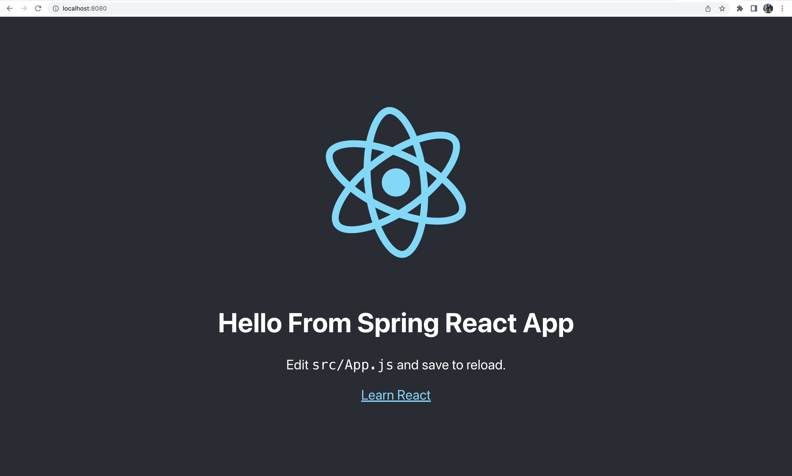

# SpringBoot-React-Starter-Project
Starter Project That Using SpringBoot in Backend and React JS in Frontend.
The Spring Application and the React App are combined in a single Jar file.

* Spring boot is used to start and maintain a spring application quickly and easily.
* Create React App is used to start a React project very quickly.

## Pre- Requisite

* Java 11
* Maven 3 (version 3.6.3)
* Node (v16.14.2)

## Run

```
mvn clean install
```
A Jar file will be created inside the target folder.

To run the Jar file, use following command

```
java -jar target/spring-react-app-0.0.1-SNAPSHOT.jar
```

Go to http://localhost:8080/ and you should see your application running.


## Developer Setup

* Clone this Repo in your local machine.
* For the Springboot Application development, open the Project in **IntelliJ Idea** as a Maven Project.
* For React Application development, open **_frontend_** directory in **Visual Studio Code**.
* Make sure to Run the SpringBoot App before running the React App.